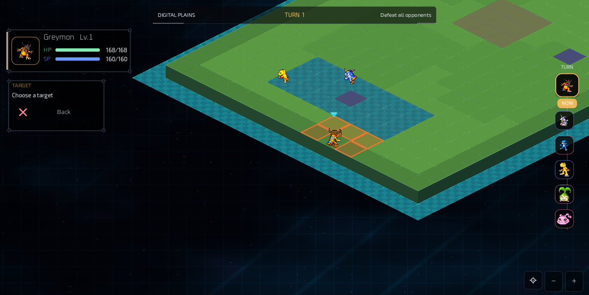
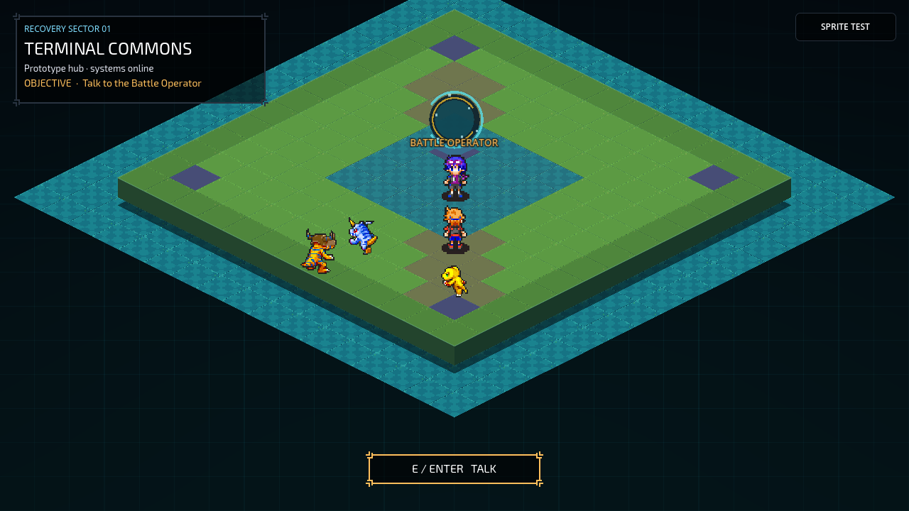
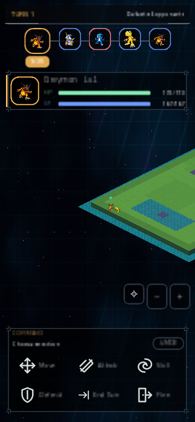

# Digi Game — working title

An unofficial, non-commercial Digimon isometric tactical RPG being built in Godot by a solo developer.

Digi Game combines branching progression inspired by the Nintendo DS *Digimon Story* games with grid battles for teams of up to three Digimon. Positioning, terrain, attack shapes, displacement, and team synergy are intended to matter as much as preparation outside combat.

## Project status

The project is an early prototype, not a finished game. A public playtest is **not open yet**. The current goal is a focused 20–30 minute vertical slice that can be understood without developer guidance.

| Available in the prototype | Planned or still experimental |
| --- | --- |
| Isometric hub and battle scenes | A complete campaign with a beginning, middle, and ending |
| Grid movement, attack range, target patterns, turn flow, and enemy AI | The Link system for coordinated ally actions |
| DigiLab progression foundations with branching digivolution and degeneration | A hub that expands visually and functionally through the campaign |
| Persistent Digimon instances, rewards, stats, and data validation | Final balance, content, art direction, tutorials, and accessibility pass |
| Web export with desktop and mobile browser checks | Public browser playtest after the vertical-slice gate |

The data and runtime currently support many early-rank Digimon for development and automated testing. This does **not** mean that every supported Digimon is content-complete or ready for release.

## Current prototype

| Hub | Mobile Web layout |
| --- | --- |
|  |  |

### Controls

- Hub: move with `WASD` or the arrow keys; use `E` or `Enter` to interact.
- Battle: select units, tiles, and actions with the pointer. Drag with the right mouse button to pan and use the mouse wheel to zoom.
- Mobile Web: use the on-screen movement and action controls; tap to select, drag to pan, and pinch or use the zoom buttons to zoom.

Controls, layouts, and onboarding are still being refined for the first external playtest.

## Design direction

The current design targets:

- branching digivolution and degeneration handled in the DigiLab;
- tactical combat built around movement, range, area patterns, terrain, and displacement;
- teams of up to three Digimon;
- a planned Link system for coordinated actions;
- a campaign hub that grows with story progress;
- one complete single-player campaign;
- a Web build that works without installation, including mobile support.

Read the evolving [game design plan](Plan.md) for the detailed rules, scope, and narrative direction.

## Community and playtests

Community spaces are being prepared before the first public build. Until the vertical slice is ready, development updates will focus on one mechanic or design decision at a time and will clearly label features as implemented, experimental, or planned.

- [Community operating plan](docs/community/README.md)
- [Player-visible changelog](CHANGELOG.md)
- [Vertical-slice release gate](docs/community/vertical-slice-gate.md)
- [Feedback template](docs/community/feedback-template.md)
- [90-day content calendar and post kit](docs/community/content-calendar.md)

GitHub Issues are used for internal development tracking. Player feedback will be collected through the community Discord and a simplified feedback worksheet once those channels open.

## Disclaimer

> Digi Game is a non-commercial fan project. Digimon and all related characters and properties belong to their respective rights holders. This project is not affiliated with or endorsed by Bandai, Bandai Namco, Toei Animation, or other rights holders.

No commercial release, crowdfunding campaign, or paid access is planned.
